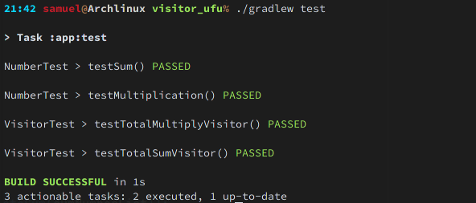
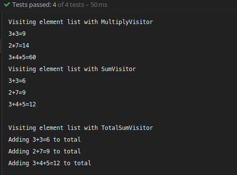
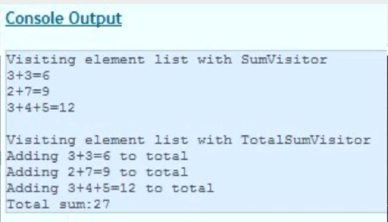

# Design Pattern Visitor

### instruções

- Reproduza o exemplo de visitor da aula prática SumVisitor e TotalSumVisitor.


- Em seguida, reescreva o programa retirando o padrão Visitor e implementando de maneira convencional preservando melhor
  o princípio da localidade e o encapsulamento.


- Em seguida, aumente exemplo de visitor da aula para incluir novos visitor de Multiplicação e de Soma Total dos
  Elementos Multiplicados, similares aos existentes.

[Video aula](docs/VideoAula-23-Visitor.mp4)

### Implementação

Foi feito 2 conjuntos de testes, o primeiro demonstrando a implementação do visitor e o segundo demonstrando uma
implementação respeitando o encapsulamento, ou seja sem visitor.

#### Primeiro conjunto de testes

```java
// VisitorTest.java
class VisitorTest {
    @Test
    void testTotalSumVisitor() {
        TwoElement two1 = new TwoElement(3, 3);
        TwoElement two2 = new TwoElement(2, 7);
        ThreeElement three = new ThreeElement(3, 4, 5);

        List<NumberElement> numberElementList = new ArrayList<>();
        numberElementList.add(two1);
        numberElementList.add(two2);
        numberElementList.add(three);
        System.out.println("Visiting element list with SumVisitor");
        new SumVisitor().visit(numberElementList);

        System.out.println("\nVisiting element list with TotalSumVisitor");
        TotalSumVisitor visitor = new TotalSumVisitor();
        visitor.visit(numberElementList);

        assertEquals(27, visitor.getTotalSum());
    }


    @Test
    void testTotalMultiplyVisitor() {
        TwoElement two1 = new TwoElement(3, 3);
        TwoElement two2 = new TwoElement(2, 7);
        ThreeElement three = new ThreeElement(3, 4, 5);

        List<NumberElement> numberElementList = new ArrayList<>();
        numberElementList.add(two1);
        numberElementList.add(two2);
        numberElementList.add(three);

        System.out.println("\nVisiting element list with MultiplyVisitor");
        new MultiplyVisitor().visit(numberElementList);

        SumMultiplyVisitor visitor = new SumMultiplyVisitor();
        visitor.visit(numberElementList);

        assertEquals(83, visitor.getTotalSum());
    }
}
```

#### Segundo conjunto de testes

```java
// numberTest.java
public class NumberTest {

    @Test
    void testSum() {
        TwoNumber two1 = new TwoNumber(3, 3);
        TwoNumber two2 = new TwoNumber(2, 7);
        ThreeNumber three = new ThreeNumber(3, 4, 5);

        assertEquals(6, two1.sum());
        assertEquals(9, two2.sum());
        assertEquals(12, three.sum());

        List<SumOperation> sumNumberList = new LinkedList<>();
        sumNumberList.add(two1);
        sumNumberList.add(two2);
        sumNumberList.add(three);

        assertEquals(27, new ListNumberCalculator().calculateSum(sumNumberList));
    }

    @Test
    void testMultiplication() {
        TwoNumber two1 = new TwoNumber(3, 3);
        TwoNumber two2 = new TwoNumber(2, 7);
        ThreeNumber three = new ThreeNumber(3, 4, 5);
        assertEquals(9, two1.multiply());
        assertEquals(14, two2.multiply());
        assertEquals(60, three.multiply());

        List<MultiOperation> sumNumberList = new LinkedList<>();
        sumNumberList.add(two1);
        sumNumberList.add(two2);
        sumNumberList.add(three);

        assertEquals(83, new ListNumberCalculator().calculateSumMultiplication(sumNumberList));
    }
}
```

Passando nos testes



Também foi feito o __SumMultiplyVisitor__ e __MultiplyVisitor__
que olhando de perto os testes do visitor consegue observar no terminal:



output similar ao do vídeo, __considerando que certos valores não foram mostrados visto que eles já são verificados
pelos testes unitários__
